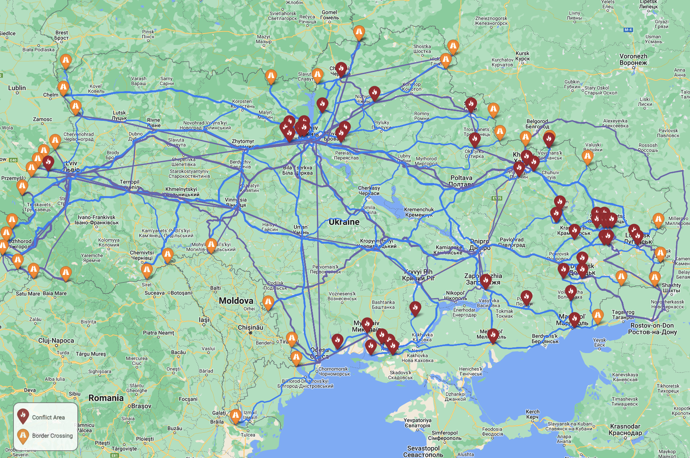
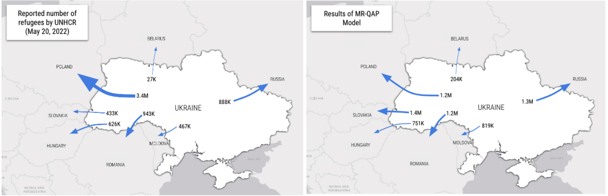

# Refugee Modeling with MR-QAP and Mixed Integer Programming

This repository complains an ensemble model for developing refugee routes and flows for large scaled forced migration events, such as the 2022 conflict in Ukraine. This model has the following steps:

1. For a given conflict country `i`, generate attraction scores for each of its neighbors `j`. 
2. For each conflict zone within the conflict country `i`, determine the best possible transit and driving routes to each of the neighbors `j`.
3. Route refugees from each conflict zone to the neighbors based on the total number of real or assumed refugees by minimizing travel duration while producing gross flows in proportion with the attraction scores determined in step 1 above.

     
     
    <i>Example Route Map for Ukraine Conflict</i>

## Data preparation
Data was collected from a variety of sources. Data pre-processing is performed in `data_prep/data-alignment.ipynb`.

Refugee data for the Ukraine conflict was gathered on May 20, 2022. Routes were generated using Google Distance Matrix and Directions APIs on May 31, 2022.

> Note: Google directions are dynamic over time due to changing road conditions and transit route availability.

## MR-QAP for haven country attraction

The first modeling step is a model developed in R, `1-attraction-mr-qap.R`. It uses the SNA library's network linear model to generate a conflict driven migration model trained on 9 historic conflicts and historic GDP and a liberal democracy index. This model is trained on conflicts in:

- Afghanistan
- Burundi
- Central African Republic
- Democratic Republic of the Congo
- Somalia
- South Sudan
- Syria
- Venezuela
- Nigeria

The model is then fit to the Ukraine conflict to generate predictions. The resulting gross refugee flows can be compared to the UNHCR's actual reported numbers:

  
   
  <i>Comparing the UNHCR reported refugee counts with the results of the MR-QAP model</i>

## Ego route generation

`2-ego-routing.ipynb` is a notebook that generates potential routes between conflict zones in `i` and border crossings in each `j`. The Google Distance Matrix API is used to determine the transit and driving duration between each conflict zone and each border crossing for the Ukraine conflict. Conflict zones are derived from ACLED and border crossing information was provided by the [Ukrainian Government](https://kordon.customs.gov.ua/en/home/countries/md/o). 

For each conflict, crossing pair a travel duration for driving and transit travel modes was calculated using the Google Distance Matrix API. Next, for each mode, the shortest (by duration) route was selected from each conflict to each neighboring country `j` from among the routes to each of `j`'s border crossings.

## Mixed integer programming model

Next, `3-mixed-integer-program.ipynb` implements a mixed integer programming model to determine flows over each of the routes derived above. This implementation uses the [COIN-OR Branch-and-Cut solver](https://github.com/coin-or/Cbc) as implemented in [PuLP](https://coin-or.github.io/pulp/) to route refugees in proportion to the population affected at each conflict zone while respecting gross flows determined by the MR-QAP attraction model and minimizing aggregate travel duration for all refugees.

## Result mapping

Finally, results of selected routes and flows are mapped with `4-results-mapping.ipynb`.